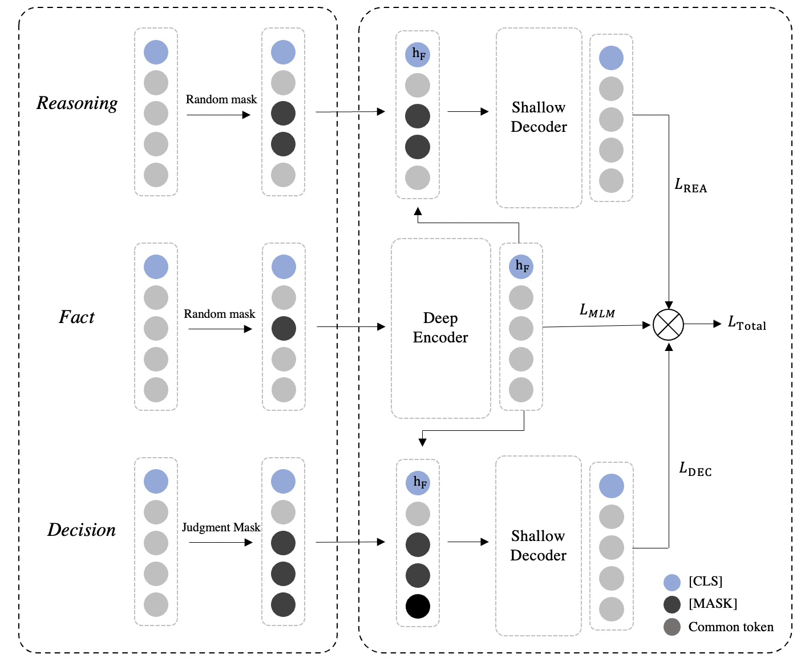

<!--
 * @Author: lihaitao
 * @Date: 2023-04-28 14:10:14
 * @LastEditors: Do not edit
 * @LastEditTime: 2023-05-09 23:23:48
 * @FilePath: /lht/GitHub_code/sailer_old/README.md
-->
# SAILER: Structure-aware Pre-trained Language Model for Legal Case Retrieval

The official repo for our SIGIR'23 Full paper: [SAILER: Structure-aware Pre-trained Language Model for Legal Case Retrieval](https://arxiv.org/abs/2304.11370). 

## Introduction

SAILER is a structure-aware pre-trained language model. It is highlighted in the following three aspects: 

- SAILER fully utilizes the structural information contained in legal case documents and pays more attention to key legal elements, similar to how legal experts browse legal case documents. 

- SAILER employs an asymmetric encoder-decoder architecture to integrate several different pre-training objectives. In this way, rich semantic information across tasks is encoded into dense vectors. 

- SAILER has powerful discriminative ability, even without any legal annotation data. It can distinguish legal cases with different charges accurately. 

The following figure shows the model structure. SAILER consists of a deep encoder and two shallow decoders. The Reasoning and Decision section are aggressively masked, joined with the Fact embedding to reconstruct the key legal elements and the judgment results.




## Installation

### Requirements
```
python=3.8
transformers==4.27.1
tqdm==4.65.0 
datasets==2.10.1
torch==1.11.0
faiss==1.7.3 
pytorch==1.12.1
pyserini==0.20.0
jieba==0.42.1 
```

### Released Models

We have uploaded some checkpoints to Huggingface Hub.

| Model              | Description                                               | Link                                                         |
| ------------------ | --------------------------------------------------------- | ------------------------------------------------------------ |
| SAILER_zh          | Pre-training on Chinese criminal law legal case documents               | [CSHaitao/SAILER_zh](https://huggingface.co/CSHaitao/SAILER_zh)    |
| SAILER_en          | Pre-trianed on English legal case documents                | [CSHaitao/SAILER_en](https://huggingface.co/CSHaitao/SAILER_en) |
| SAILER_en_finetune | Finetune the SAILER_en on the COLIEE training data | [CSHaitao/SAILER_en_finetune](https://huggingface.co/CSHaitao/SAILER_en_finetune)                     |


You can load them quickly with following codes:

```
from transformers import AutoModel
model = AutoModel.from_pretrained('CSHaitao/SAILER_zh')
```


## Pretrain

### Data format

Before pre-training, you need to process the data into the following form:
```
{   
    "fact": basic fact,
    "interpretation": reasoning section, 
    "articles": related criminal law articles,
    "judgment": decision section,
}

```
data_example.json provides some examples of training data.

The case law system does may not have relevant articles. We can correspondingly modify `SAILER_Collator` in data.py to implement pre-training.

The pre-trained corpus is not publicly available due to data permissions. The legal case documents can be downloaded from [Einglish](https://case.law/) or [Chinese](https://wenshu.court.gov.cn/).

### Train

We can pre-train model with ```sh sailer.sh```

```
    BATCH_SIZE_PER_GPU=36
    GRAD_ACCU=4

    CUDA_VISIBLE_DEVICES=0 python -m torch.distributed.launch \
    --nproc_per_node 1 \
    --master_port 29508 \
    run_pretraining.py \
    --model_name_or_path bert-base-chinese \
    --output_dir $OUTPUT_DIR/model/SAILER_bert \
    --do_train \
    --logging_steps 50 \
    --save_steps 500 \
    --fp16 \
    --logging_dir $OUTPUT_DIR/tfboard/$MODEL_NAME \
    --warmup_ratio 0.1 \
    --per_device_train_batch_size $BATCH_SIZE_PER_GPU \
    --gradient_accumulation_steps $GRAD_ACCU \
    --learning_rate 5e-5 \
    --overwrite_output_dir \
    --dataloader_drop_last \
    --dataloader_num_workers 4 \
    --max_seq_length 512 \
    --num_train_epochs 10 \
    --train_path ./data/data_example.json \
    --weight_decay 0.01 \
    --encoder_mask_ratio 0.15 \
    --decoder_mask_ratio 0.45 \
    --use_decoder_head \
    --enable_head_mlm \
    --ddp_find_unused_parameters False \
    --n_head_layers 1 

```

where `encoder_mask_ratio` and `decoder_mask_ratio` represent the mask rate of encoder and decoder respectively. `n_head_layers` is the number of decoder layers.

## Finetune

### Data format

Before finetuning, you need to process the data into the following form:
```
{'query': TEXT_TYPE, 'positives': List[TEXT_TYPE], 'negatives': List[TEXT_TYPE]}
...

```

### Train

To finetune the dense retriever, call the dense.driver.train module:

```
python -m dense.driver.train \  
  --output_dir $OUTDIR \  
  --model_name_or_path bert-base-uncased \  
  --do_train \  
  --save_steps 20000 \  
  --train_dir $TRAIN_DIR \
  --fp16 \  
  --per_device_train_batch_size 8 \  
  --learning_rate 5e-6 \  
  --num_train_epochs 2 \  
  --dataloader_num_workers 2
```

More finetune code details can be found in [Dense](https://github.com/luyug/Dense)

## Evaluation

[trec_eval](https://trec.nist.gov/trec_eval/) is employed to evaluate the model performance

You can run `sh eval.sh` to do a simple evaluation
```
trec_eval-9.0.7/trec_eval ../result/qrel.trec ../result/SAILER_LeCaRD -m all_trec
```

You will get
```
P_5 0.9084
recall_5 0.1880
ndcg_cut_10 0.7979
ndcg_cut_20 0.8190
ndcg_cut_30 0.8514
```


## Citations

If you find our work useful, please do not save your star and cite our work:

```
@misc{SAILER,
      title={SAILER: Structure-aware Pre-trained Language Model for Legal Case Retrieval}, 
      author={Haitao Li and Qingyao Ai and Jia Chen and Qian Dong and Yueyue Wu and Yiqun Liu and Chong Chen and Qi Tian},
      year={2023},
      eprint={2304.11370},
      archivePrefix={arXiv},
      primaryClass={cs.IR}
}
```


